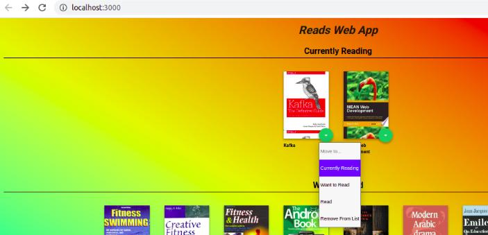

# My-Read-WebApp Project
My-Read-WebApp project is a bookshelf app that allows you to select and categorize books you have read, are currently reading, or want to read. The project emphasizes using React to build the application.

# Run the APP
download or clone the repository in your computer:
The App using Node.js for backend accourdingly you need to install it.
you can download it here: [Node.js](https://nodejs.org/en/)


Open the terminal in project directory then run the following to install all project dependencies:

### ```npm install```

To run the App:

### ```npm start```  or  ```yarn start```

How the App work

## When you run the App will see the home Page will navigate to[http://localhost:3000/](http://localhost:3000/) as below:
## You can Search for books via the ADD BOOK link below:


## Change book shelf through the Green button.



## From search page you can search for books and add it to your read app home page using the Green button.


### Resources and Documentation:
* [Getting started](https://reactjs.org/docs/getting-started.html)
* [Create-react-app Documentation](https://github.com/facebookincubator/create-react-app)
* [React Router Documentation](http://knowbody.github.io/react-router-docs/)
* [Project starter template](https://github.com/udacity/reactnd-project-myreads-starter)
* [Project Rubric](https://review.udacity.com/#!/rubrics/918/view)

### Search Terms
'Android', 'Art', 'Artificial Intelligence', 'Astronomy', 'Austen', 'Baseball', 'Basketball', 'Bhagat', 'Biography', 'Brief', 'Business', 'Camus', 'Cervantes', 'Christie', 'Classics', 'Comics', 'Cook', 'Cricket', 'Cycling', 'Desai', 'Design', 'Development', 'Digital Marketing', 'Drama', 'Drawing', 'Dumas', 'Education', 'Everything', 'Fantasy', 'Film', 'Finance', 'First', 'Fitness', 'Football', 'Future', 'Games', 'Gandhi', 'Homer', 'Horror', 'Hugo', 'Ibsen', 'Journey', 'Kafka', 'King', 'Lahiri', 'Larsson', 'Learn', 'Literary Fiction', 'Make', 'Manage', 'Marquez', 'Money', 'Mystery', 'Negotiate', 'Painting', 'Philosophy', 'Photography', 'Poetry', 'Production', 'Programming', 'React', 'Redux', 'River', 'Robotics', 'Rowling', 'Satire', 'Science Fiction', 'Shakespeare', 'Singh', 'Swimming', 'Tale', 'Thrun', 'Time', 'Tolstoy', 'Travel', 'Ultimate', 'Virtual Reality', 'Web Development', 'iOS'